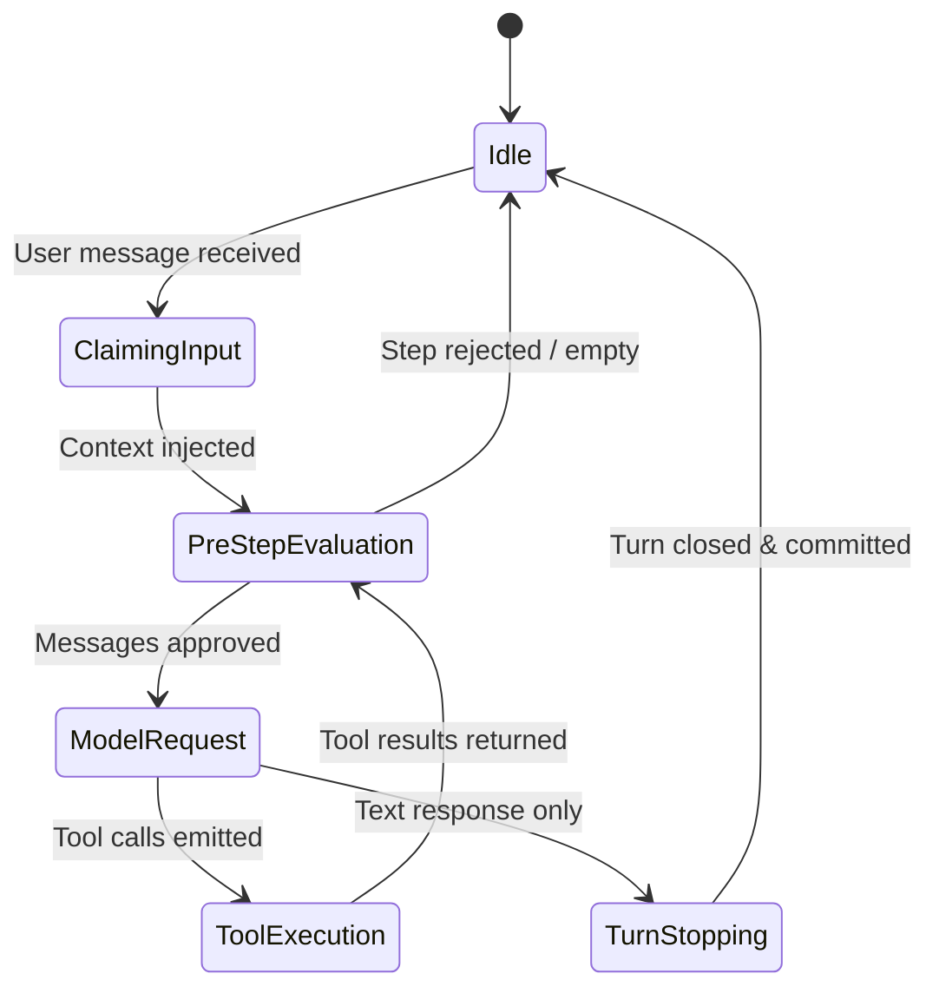

# Business Logic & Runtime Semantics — NEXUS Execution Harness

**Project:** NEXUS Execution Harness (`@deepseek-ai/dsh`)
**Core Runtime:** Turn loop execution, compaction, permissions, and subagent governance

---

## 📐 Core Runtime Rules

1. **Turn Boundedness**: A turn claims one user message plus any queued context inputs. It loops across steps as long as tool calls request follow-ups, but stops immediately once no tool calls remain or a tool flags completion.
2. **Ambient Grounding Priority**: On turn step 1, ambient context listeners (such as `nexus-brain-context`) inject project orientation into the prompt before the model evaluates the user's instructions.
3. **Approval Gating**: Dangerous operations (destructive file overwrites, arbitrary shell commands) route to the permission seam, halting execution until the human user confirms via the web UI or CLI.
4. **Child Report Obligation**: A spawned continuable subagent must deliver a structured settlement report to its parent agent before the parent's turn is considered successfully settled.

---

## 🔄 Agent State Machine

---

## 🧮 Compaction & Scoping Algorithms

### 1. Skill Catalog Project Scoping (`skill-filesystem`)
When indexing global skills from `~/.agents/skills/`:
- If a skill declares `projects: [name1, name2]`, it is filtered against `path.basename(ctx.workspaceRoot)`.
- If the current project matches, the skill is admitted into the model-visible catalog.
- If it does not match, the skill is suppressed, saving token budget.
- If `projects` is omitted or malformed, it defaults to open (unscoped).

### 2. Context Compaction
- Monitors current session token consumption against the active model's context window.
- Summarizes historical turns into structured memory checkpoints while preserving critical durable events.
